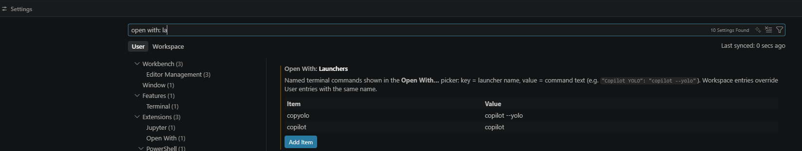
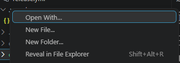
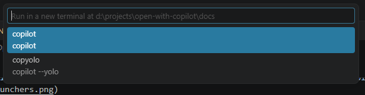

# Open With

[](https://github.com/yldgio/vscode-open-with/actions/workflows/ci.yml)

Run named, user-configured terminal commands from an Explorer folder's right-click
menu: launch Copilot CLI (`copilot --yolo`), Codex, or any other CLI in a new
editor-area terminal with the clicked folder as its working directory.

## Install

Download `open-with.vsix` from the
[latest release](https://github.com/yldgio/vscode-open-with/releases/latest), then
either:

- Extensions view → `…` → **Install from VSIX…**, or
- `code-insiders --install-extension open-with.vsix`

## Usage

**1. Add a launcher.** Open Settings (`Ctrl+,`), search for `open with`, and under
**Open With: Launchers** click **Add Item**. *Item* is the name shown in the menu,
*Value* is the command to run:



Prefer JSON? The same thing in `settings.json`:

```jsonc
{
  "openWith.launchers": {
    "Copilot": "copilot",
    "Copilot YOLO": "copilot --yolo"
  }
}
```

**2. Run it.** Right-click a folder in the Explorer (workspace roots work too) →
**Open With…**:



…then pick the launcher by name (the command it runs is shown underneath):



A new terminal opens in the editor area, named after the launcher, with the folder
as its working directory, running the command.

**Notes**

- Workspace settings add to User settings; a Workspace entry overrides a User entry
  with the same name.
- Entries with a blank name or command show an error and are skipped — the rest keep
  working.
- The **Open With…** menu item only appears when at least one valid launcher exists.

Invalid launcher entries (blank name, missing or blank command) produce an explicit
error; valid entries keep working. The menu item hides when no valid launcher exists.

## Settings

| Setting | Description |
| --- | --- |
| `openWith.launchers` | Object map of launcher name → command text. |
| `openWith.shellPath` | Optional shell executable replacing the default shell profile. |
| `openWith.shellArgs` | Optional arguments for `openWith.shellPath`. |

In untrusted workspaces, Workspace-scope launchers and shell override values are
ignored (enforced by VS Code).

## Development

- `npm run compile` — bundle the extension with esbuild.
- `npm run watch` — rebuild on change (use with the **Run Extension** launch config).
- `npm run test:unit` — unit tests (`node:test`).
- `npm run test:integration` — extension-host tests (`@vscode/test-electron`, mocha).
- `npm run package` — build a local VSIX with vsce.
